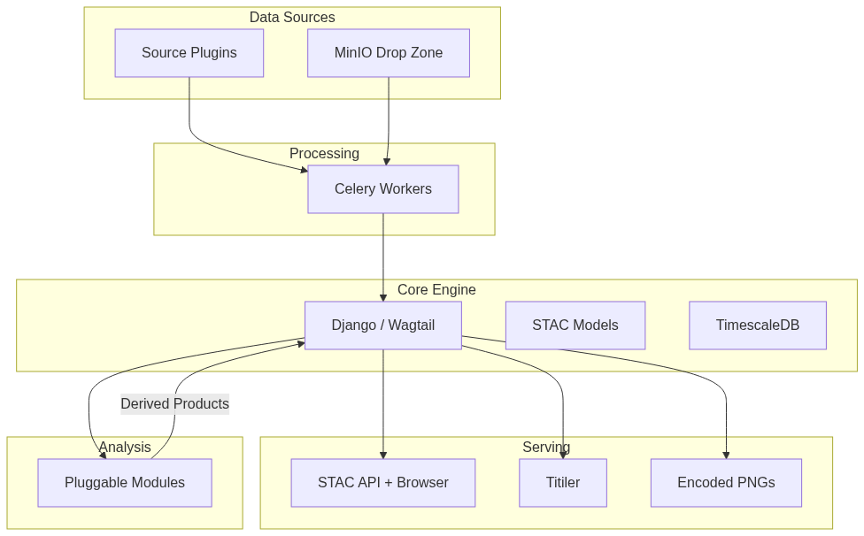

# GeoRiva

**Geospatial Raster Ingestion, Visualization & Analysis**

GeoRiva is a geospatial backend platform for automated ingestion, processing, visualization, and analysis of gridded
raster data. Built on Django/Wagtail, it provides a plugin-driven architecture for pulling data from diverse sources,
serving it through modern standards-compliant APIs, and enabling analytical workflows on top of it.

> **Status:** Early development — architecture phase. See
> the [Architecture Design Document](docs/architecture/README.md) for the full system design and open discussion points.

---

## What It Does

- **Ingest** gridded data from multiple sources via plugin apps or by dropping files into a MinIO directory
- **Process** data into cloud-optimized formats (COG, encoded PNG) through an async Celery pipeline
- **Index** everything as STAC-compliant Catalogs, Collections, and Items with time-series optimized storage
- **Serve** tiles and data through a STAC API, Titiler tile server, and encoded PNGs for browser-side rendering
- **Analyze** data using pluggable modules that integrate with the Xarray-compatible scientific Python ecosystem
- **Visualize** with modern browser-side rendering (WeatherLayers GL), moving beyond legacy WMS

## Architecture at a Glance



For the detailed architecture with diagrams, data model, and design decisions,
see [docs/architecture/README.md](docs/architecture/README.md).

---

## Tech Stack

| Component        | Technology                            |
|------------------|---------------------------------------|
| Core Framework   | Django 5.x + Wagtail                  |
| Database         | PostgreSQL 16 + TimescaleDB + PostGIS |
| Object Storage   | MinIO (S3-compatible)                 |
| Task Queue       | Celery + Redis                        |
| Tile Server      | Titiler                               |
| Data Formats     | COG, Zarr, Encoded PNG                |
| Messaging        | Mosquitto (MQTT)                      |
| Containerization | Docker Compose                        |

---

## Getting Started

### Prerequisites

- [Docker](https://docs.docker.com/get-docker/) and [Docker Compose](https://docs.docker.com/compose/install/) (v2+)
- Git

### Quick Start (Production)

1. **Clone the repository**

   ```bash
   git clone https://github.com/wmo-raf/georiva.git
   cd georiva
   ```

2. **Configure environment variables**

   ```bash
   cp .env.sample .env
   ```

   Edit `.env` and set the required values. At minimum, you need to set:

    - `SECRET_KEY` — Django secret key
    - `GEORIVA_DB_USER`, `GEORIVA_DB_NAME`, `GEORIVA_DB_PASSWORD` — database credentials
    - `MINIO_ROOT_USER`, `MINIO_ROOT_PASSWORD` — MinIO credentials
    - `MINIO_WEBHOOK_BEARER_TOKEN` — token for MinIO webhook authentication
    - `ALLOWED_HOSTS` — comma-separated list of allowed hostnames
    - `CSRF_TRUSTED_ORIGINS` — comma-separated list of trusted origins

3. **Start the stack**

   ```bash
   docker compose up -d
   ```

   On first run, the entrypoint automatically handles database migrations and static file collection.

4. **Access GeoRiva**

   Open [http://localhost](http://localhost) in your browser.

   Additional services:
    - **STAC Browser:** [http://localhost/stac-browser/](http://localhost/stac-browser/)

### Development Setup

The dev setup uses a compose override that mounts your source code for hot reloading.

1. **Follow steps 1–2 from Quick Start above.**

2. **Start with the dev override**

   ```bash
   docker compose -f docker-compose.yml -f docker-compose.dev.yml up -d
   ```

   This gives you:

    - **Django dev server** with auto-reload on code changes
    - **Celery worker** with auto-reload
    - **Source code mounted** from `./georiva` into the container

   Optionally, create a shortcut in your shell:

   ```bash
   alias dc-dev="docker compose -f docker-compose.yml -f docker-compose.dev.yml"
   ```

3. **Useful commands**

   ```bash
   # View logs
   docker compose logs -f georiva

   # Run management commands
   docker compose exec georiva python manage.py createsuperuser
   docker compose exec georiva python manage.py shell

   # Rebuild after dependency changes
   docker compose build georiva

   # Restart a single service
   docker compose restart georiva-celery-worker
   ```

### Installing Plugins

Plugins can be installed at build time or at runtime.

**Build time** — bake plugins into the image:

```bash
GEORIVA_PLUGIN_GIT_REPOS=https://github.com/org/plugin1.git,https://github.com/org/plugin2.git \
  docker compose build georiva
```

**Runtime** — set `GEORIVA_PLUGIN_GIT_REPOS` in your `.env` file and restart. Ensure
`GEORIVA_DISABLE_PLUGIN_INSTALL_ON_STARTUP` is not set to `"true"`.

## Project Structure

TODO

---

## Contributing

GeoRiva is in its early stages and contributions are welcome — especially feedback on the architecture.

**Where to start:**

1. Read the [Architecture Design Document](docs/architecture/README.md) to understand the system design
2. Check the [Open Questions](docs/architecture/README.md#9-open-questions--discussion-points) section for areas where
   input is needed
3. See [docs/contributing.md](docs/contributing.md) for development setup and guidelines

**Ways to contribute:**

- Review and comment on the architecture
- Build a source plugin for a data provider you know well
- Build an analysis module for your domain
- Improve documentation
- Report bugs and suggest features via issues

---

## Documentation

| Document                                                    | Description                                                |
|-------------------------------------------------------------|------------------------------------------------------------|
| [Architecture Design Document](docs/architecture/README.md) | Full system architecture, data model, and design decisions |
| [Contributing Guide](docs/contributing.md)                  | How to set up a dev environment and contribute             |

---

## License

[TBD]
