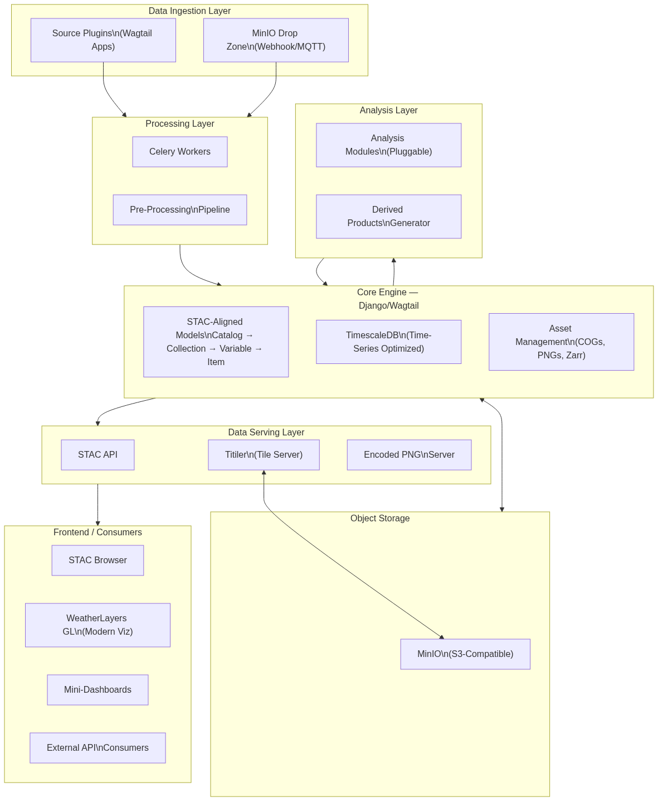
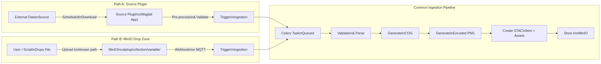
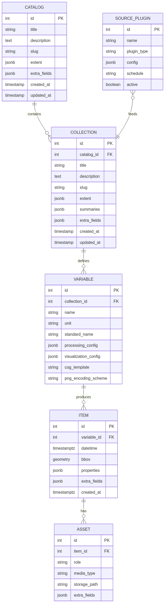
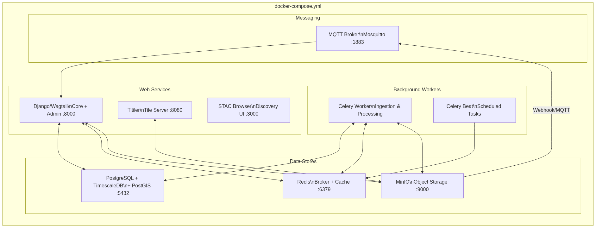

# GeoRiva — Architecture Design Document

**Geospatial Raster Ingestion, Visualization & Analysis**

|             |                              |
|-------------|------------------------------|
| **Status**  | Draft — Request for Comments |
| **Version** | 0.1                          |
| **Date**    | 2025-02-09                   |
| **Author**  | Erick                        |

---

## Table of Contents

- [1. Introduction](#1-introduction)
    - [1.1 Purpose & Scope](#11-purpose--scope)
    - [1.2 Design Principles](#12-design-principles)
    - [1.3 Intended Audience](#13-intended-audience)
- [2. System Architecture Overview](#2-system-architecture-overview)
    - [2.1 Layer Responsibilities](#21-layer-responsibilities)
- [3. Data Ingestion](#3-data-ingestion)
    - [3.1 Path A: Source Plugins](#31-path-a-source-plugins)
    - [3.2 Path B: MinIO Drop Zone](#32-path-b-minio-drop-zone)
    - [3.3 Common Ingestion Pipeline](#33-common-ingestion-pipeline)
- [4. Data Model](#4-data-model)
    - [4.1 Entity Descriptions](#41-entity-descriptions)
    - [4.2 Key Design Decisions](#42-key-design-decisions)
- [5. Data Serving & Visualization](#5-data-serving--visualization)
    - [5.1 STAC API](#51-stac-api)
    - [5.2 Tile Serving with Titiler](#52-tile-serving-with-titiler)
    - [5.3 Encoded PNGs for Frontend Shading Libraries](#53-encoded-pngs-for-frontend-shading-libraries)
    - [5.4 STAC Browser](#54-stac-browser)
- [6. Analysis Layer](#6-analysis-layer)
    - [6.1 Core Analysis Capabilities](#61-core-analysis-capabilities)
    - [6.2 Pluggable Analysis Modules](#62-pluggable-analysis-modules)
    - [6.3 Integration with Existing Analysis Libraries](#63-integration-with-existing-analysis-libraries)
    - [6.4 Zarr for Analysis-Ready Data](#64-zarr-for-analysis-ready-data)
    - [6.5 Mini-Dashboards](#65-mini-dashboards)
- [7. Infrastructure & Deployment](#7-infrastructure--deployment)
    - [7.1 Service Inventory](#71-service-inventory)
    - [7.2 Key Infrastructure Decisions](#72-key-infrastructure-decisions)
- [8. Technology Stack Summary](#8-technology-stack-summary)
- [9. Open Questions & Discussion Points](#9-open-questions--discussion-points)
- [10. Next Steps](#10-next-steps)

---

## 1. Introduction

This Architecture Design Document (ADD) lays out the technical vision, design principles, and system architecture for
GeoRiva — a geospatial backend platform for automated ingestion, visualization, and analysis of gridded raster data.

The document is structured as a Request for Comments (RFC). It captures the author's current thinking on how the system
should be built, and invites contributors to review, challenge, and refine the architecture before and during
implementation.

### 1.1 Purpose & Scope

GeoRiva is designed to serve as a general-purpose foundation for any system that needs to:

1. Pull gridded geospatial data from diverse sources
2. Process it for web-based visualization
3. Expose it through standards-compliant APIs
4. Enable analytical workflows — from simple time-series queries to complex domain-specific computations

The initial target domain is meteorological data for African National Meteorological Services, but the architecture is
intentionally domain-agnostic. Any field that works with gridded raster data (agriculture, hydrology, environmental
monitoring, etc.) should be able to build on GeoRiva.

### 1.2 Design Principles

- **STAC-first mental model:** We think in terms of Catalogs, Collections, and Items from the start, aligning our
  internal data model with the SpatioTemporal Asset Catalog (STAC) specification.
- **Plugin-driven extensibility:** Data sources and analysis modules are implemented as plugins (Wagtail apps) that
  conform to defined contracts, enabling community contributions without modifying the core engine.
- **Modern visualization:** Move away from legacy WMS tile serving toward browser-side rendering with encoded data
  tiles, enabling smooth animations, interactive layer picking, and interpolation.
- **Cloud-optimized storage:** Cloud Optimized GeoTIFF (COG) as the canonical storage format, with MinIO (S3-compatible)
  as the object store.
- **Async-first processing:** All long-running operations (ingestion, processing, analysis) run as Celery tasks, keeping
  the web layer responsive.
- **Composable via Docker:** The entire stack is orchestrated via Docker Compose for consistent development and
  deployment.

### 1.3 Intended Audience

This document is intended for developers and contributors who will participate in building GeoRiva. It assumes
familiarity with Django, Docker, and basic geospatial concepts. Domain-specific terms (STAC, COG, Zarr) are explained
where they first appear.

---

## 2. System Architecture Overview

GeoRiva is composed of six distinct architectural layers, each with well-defined responsibilities. Data flows from
ingestion sources through processing into a STAC-aligned core, then out through serving and analysis layers to frontend
consumers.



*Figure 1: GeoRiva System Architecture Overview*

The layers are designed to be loosely coupled. The ingestion layer knows nothing about visualization. The analysis layer
produces new Items that flow back into the core, making derived products indistinguishable from raw ingested data. The
serving layer reads from the core and object storage without concern for how data arrived there.

### 2.1 Layer Responsibilities

| Layer              | Responsibility                                                                                                                                     |
|--------------------|----------------------------------------------------------------------------------------------------------------------------------------------------|
| **Data Ingestion** | Source plugins and MinIO drop zones bring external data into the system. Each path handles scheduling, downloading, and pre-processing.            |
| **Processing**     | Celery workers execute the ingestion pipeline: validation, COG generation, PNG encoding, STAC indexing, and storage.                               |
| **Core Engine**    | Django/Wagtail application housing the STAC-aligned data models, admin interface, and coordination logic. PostgreSQL with TimescaleDB and PostGIS. |
| **Object Storage** | MinIO provides S3-compatible storage for all binary assets (COGs, PNGs, Zarr archives). Titiler reads directly from here.                          |
| **Data Serving**   | STAC API for discovery, Titiler for tile serving, and encoded PNG endpoints for frontend shading library integration.                              |
| **Analysis**       | Pluggable analysis modules that leverage existing Xarray-compatible libraries. Output feeds back into the core as new Items.                       |

---

## 3. Data Ingestion

GeoRiva supports two complementary ingestion paths that converge into a single processing pipeline. This dual-path
design accommodates both fully automated source integrations and manual or scripted data drops.



*Figure 2: Data Ingestion Flow*

### 3.1 Path A: Source Plugins

Source plugins are Wagtail apps that implement a defined base class (contract). Each plugin encapsulates the complete
logic for a specific data source:

- **Scheduling** — when to check for new data (cron or interval)
- **Downloading** — fetching from the remote source, returning a local file path
- **Pre-processing** — optional source-specific transformations (format conversion, subsetting, reprojection)
- **Triggering ingestion** — handing off to the common pipeline once a file is ready

The plugin architecture means new data sources can be developed and distributed independently of the core engine. A
plugin registers itself with the system and provides its admin UI through Wagtail's admin framework.

> **Plugin Contract (Conceptual):** A source plugin must implement: a schedule definition, a download method that
> returns a local file path, an optional pre-process method for source-specific transformations, and metadata mapping to
> the Catalog/Collection/Variable hierarchy.

### 3.2 Path B: MinIO Drop Zone

For cases where a full plugin is unnecessary, data can be ingested by simply placing files in a structured MinIO
directory. The directory hierarchy encodes the target metadata:

```
incoming/{catalog_slug}/{collection_slug}/{variable_slug}/filename.tif
```

When a file is uploaded to this path, MinIO fires a webhook or MQTT notification that the system listens for. The
notification triggers a Celery task that picks up the file and routes it through the ingestion pipeline. File naming
conventions will be defined per-variable to encode temporal information (e.g., timestamps, forecast hours).

### 3.3 Common Ingestion Pipeline

Regardless of the ingestion path, all data passes through the same Celery-powered pipeline:

1. **Queue:** A Celery task is created and queued for async execution.
2. **Validate:** The incoming file is parsed and validated against expected formats and metadata.
3. **Generate COG:** The data is converted to a Cloud Optimized GeoTIFF, the canonical storage format.
4. **Generate Encoded PNG:** A visualization-ready encoded PNG is produced for use with frontend shading libraries.
5. **Index as STAC Item:** A STAC Item record is created in TimescaleDB with the appropriate Catalog/Collection/Variable
   linkage.
6. **Store Assets:** The COG, PNG, and any other derived assets are stored in MinIO, and Asset records are linked to the
   Item.

---

## 4. Data Model

The core data model is loosely aligned with the STAC specification. This ensures that thinking in STAC terms is natural
from the start, and that exposing a STAC API requires minimal translation.



*Figure 3: STAC-Aligned Data Model*

### 4.1 Entity Descriptions

**Catalog** represents the top-level organizational container. A Catalog groups related Collections — for example by
thematic domain (weather forecasts, satellite observations, reanalysis products).

**Collection** represents a coherent dataset within a Catalog. Collections share common spatial/temporal extents and
data characteristics. A Collection might represent "GFS Forecast Data" or "CHIRPS Rainfall Estimates."

**Variable** is a GeoRiva-specific extension to the STAC hierarchy. It represents a measured or computed quantity within
a Collection (e.g., temperature, precipitation, wind speed). The Variable model holds per-variable processing
configuration (how to generate COGs), visualization configuration (color maps, value ranges), and PNG encoding schemes.

**Item** represents a single spatiotemporal data granule — one snapshot of one variable at one point in time. The Item
model is backed by a TimescaleDB hypertable partitioned on the `datetime` column, as this will be the most heavily
queried model in the system.

**Asset** represents a physical data object associated with an Item (following STAC conventions). An Item may have
multiple Assets: a COG for analysis, an encoded PNG for visualization, a thumbnail, metadata sidecar files, etc.

**Source Plugin** tracks registered data source plugins and their configuration, including scheduling, connection
parameters, and which Collection they feed into.

### 4.2 Key Design Decisions

- **TimescaleDB for Items:** The Item table is expected to grow rapidly and will be queried primarily by time range.
  TimescaleDB hypertables provide automatic partitioning and optimized time-range queries.
- **PostGIS for spatial:** The `bbox` field on Item uses PostGIS geometry types for spatial indexing and querying.
- **JSONB for extensibility:** `extra_fields` and `properties` columns use PostgreSQL JSONB to accommodate STAC
  extensions and custom metadata without schema migrations.
- **Variable as a first-class entity:** Standard STAC does not have a Variable concept. GeoRiva introduces it to hold
  per-variable configuration that would otherwise be duplicated across Items or encoded in Collection-level metadata.

---

## 5. Data Serving & Visualization

The serving layer is designed around a key philosophy: move rendering to the browser and serve data in formats that
enable modern, interactive visualization experiences comparable to applications like Windy.com.

### 5.1 STAC API

GeoRiva exposes a standards-compliant STAC API for data discovery. This allows any STAC-compatible client (including the
bundled STAC Browser) to search, filter, and browse the data catalog. The API is generated from the internal data model
with minimal translation since the models are STAC-aligned by design.

### 5.2 Tile Serving with Titiler

Titiler serves map tiles directly from Cloud Optimized GeoTIFFs stored in MinIO. A critical design goal is to keep
Titiler stateless and database-free — it should read COGs from object storage and serve tiles without hitting
PostgreSQL.

We are exploring two strategies:

- **Encoded tiles:** Titiler returns raw data-encoded tiles that the frontend shading library interprets and styles.
  This keeps server-side logic minimal and gives the frontend full control over visualization.
- **Styled tiles:** Titiler applies a color ramp server-side and returns pre-styled image tiles. This reduces frontend
  complexity but limits interactivity.

The preferred direction is encoded tiles for maximum frontend flexibility, with styled tiles as a fallback for simpler
use cases.

### 5.3 Encoded PNGs for Frontend Shading Libraries

For integration with frontend shading libraries like WeatherLayers GL, the system generates encoded PNGs where pixel
values represent actual data values (not visual colors). The frontend library decodes these values and applies styling,
interpolation, and animation in the browser. This approach enables:

- Smooth temporal animations between time steps
- Interactive value picking (hover to see the value at any point)
- Custom color ramps applied client-side in real time
- Particle/wind animations from vector data

### 5.4 STAC Browser

A standalone STAC Browser service is included in the Docker stack, connected to GeoRiva's STAC API. This provides an
out-of-the-box discovery and preview interface without requiring custom frontend development.

---

## 6. Analysis Layer

The analysis layer is where GeoRiva moves beyond data serving into data processing. The vision is to provide
analysis-ready datasets and a pluggable framework that can leverage the broader ecosystem of scientific Python libraries
for domain-specific computation.

### 6.1 Core Analysis Capabilities

At its foundation, the system will support:

- Time-series extraction at points and over regions
- Spatial subsetting and aggregation
- Basic statistical summaries

These are the building blocks that all higher-level analysis modules can rely on.

### 6.2 Pluggable Analysis Modules

Analysis modules follow the same plugin pattern as data sources. Each module implements a base contract that defines:

- **Input requirements** — which Items/Variables the module consumes
- **Computation logic** — the actual processing
- **Output specification** — new Items/Assets to generate

The output of any analysis module flows back into the core as new derived Items, fully indexed and discoverable through
the STAC API. This means derived products (climatological means, anomalies, composite indices, etc.) are first-class
citizens in the system, indistinguishable from raw ingested data.

This plugin architecture is intentionally open-ended. Contributors can build modules for any domain: climatological
analysis, agricultural indices, hydrological modeling, forecast verification — whatever the use case demands.

### 6.3 Integration with Existing Analysis Libraries

A core design goal is to not reinvent the wheel. The scientific Python ecosystem already has excellent libraries for
working with gridded data, and GeoRiva's data formats (COGs, Zarr, Xarray-compatible structures) are chosen specifically
to interoperate with them.

Analysis modules are expected to leverage existing packages rather than implement algorithms from scratch. Some examples
of the kinds of libraries that fit naturally:

| Library       | Domain                    | Example Use                                                   |
|---------------|---------------------------|---------------------------------------------------------------|
| Xclim         | Climate indices           | SPI, SPEI, growing degree days, heat wave detection           |
| Xarray / Dask | General array computation | Resampling, aggregation, parallel processing                  |
| Rioxarray     | Raster I/O                | Reading/writing COGs within analysis pipelines                |
| Verde         | Spatial processing        | Gridding, trend estimation, cross-validation                  |
| scikit-learn  | Machine learning          | Anomaly detection, classification, regression on gridded data |
| Regionmask    | Regional analysis         | Masking and aggregation by geographic regions                 |

The key consideration is Xarray compatibility — if a library works with Xarray datasets, it should slot into GeoRiva's
analysis framework with minimal friction. The system is not tied to any single analysis domain; the plugin contract
simply needs a module that can read Items in and produce Items out.

### 6.4 Zarr for Analysis-Ready Data

While COG is the canonical storage format for individual Items, Zarr is planned as an additional format for
analysis-ready data cubes. Zarr archives can be generated at the Catalog, Collection, or Variable level, aggregating
many Items into a single chunked, cloud-optimized array suitable for large-scale computation with tools like Xarray and
Dask.

### 6.5 Mini-Dashboards

Analysis results and key data summaries will be presentable as mini-dashboards embedded throughout the system. These are
lightweight, auto-updating views that surface insights from the analysis layer without requiring users to build custom
visualizations.

---

## 7. Infrastructure & Deployment



*Figure 4: Docker Compose Stack*

### 7.1 Service Inventory

| Service         | Technology       | Purpose                                                     |
|-----------------|------------------|-------------------------------------------------------------|
| Web Application | Django / Wagtail | Core engine, admin interface, STAC API, plugin host         |
| Tile Server     | Titiler          | Serves map tiles from COGs in MinIO                         |
| STAC Browser    | stac-browser     | Standalone STAC catalog browsing UI                         |
| Celery Worker   | Celery           | Executes async ingestion, processing, and analysis tasks    |
| Celery Beat     | Celery Beat      | Schedules periodic tasks (source polling, maintenance)      |
| Database        | PostgreSQL       | TimescaleDB + PostGIS for models, time-series, spatial data |
| Cache / Broker  | Redis            | Celery task broker and application cache                    |
| Object Storage  | MinIO            | S3-compatible storage for all binary assets                 |
| Message Broker  | Mosquitto        | MQTT broker for MinIO event notifications                   |

### 7.2 Key Infrastructure Decisions

- **MinIO over cloud S3:** MinIO provides S3 API compatibility while keeping the entire stack self-contained for
  on-premises deployment, which is critical for many National Meteorological Services.
- **TimescaleDB over raw PostgreSQL:** The Item model's time-series nature makes TimescaleDB's hypertables and
  compression essential for performance at scale.
- **MQTT for event-driven ingestion:** Using MQTT (via Mosquitto) for MinIO notifications enables a lightweight,
  reliable event-driven architecture for the drop zone ingestion path.
- **Redis as dual-purpose:** Redis serves as both the Celery broker and the application cache, reducing the number of
  infrastructure components.

---

## 8. Technology Stack Summary

| Category         | Technology                            | Notes                           |
|------------------|---------------------------------------|---------------------------------|
| Web Framework    | Django 5.x + Wagtail                  | Core engine, admin, plugin host |
| Database         | PostgreSQL 16 + TimescaleDB + PostGIS | Primary data store              |
| Object Storage   | MinIO                                 | S3-compatible, self-hosted      |
| Task Queue       | Celery + Redis                        | Async processing                |
| Tile Server      | Titiler                               | COG-native tile serving         |
| STAC Browser     | Radiant Earth stac-browser            | Data discovery UI               |
| Analysis         | Xarray-compatible ecosystem           | Pluggable, domain-agnostic      |
| Data Formats     | COG, Zarr, Encoded PNG                | Storage and serving formats     |
| Frontend Viz     | WeatherLayers GL                      | Browser-side rendering          |
| Messaging        | Mosquitto (MQTT)                      | Event notifications             |
| Containerization | Docker + Docker Compose               | Full stack orchestration        |
| Language         | Python 3.12+                          | Primary development language    |

---

## 9. Open Questions & Discussion Points

This section captures areas where the design is not yet settled and contributor input is especially welcome.

### 9.1 Titiler Strategy

Should Titiler serve encoded tiles or pre-styled tiles? The current leaning is toward encoded tiles for maximum frontend
flexibility, but this adds complexity to the frontend rendering pipeline. Contributor feedback on real-world experience
with either approach would be valuable.

### 9.2 Zarr Generation Strategy

At which level should Zarr archives be generated — Catalog, Collection, or Variable? Should Zarr generation be triggered
automatically as Items accumulate, or on-demand? What chunking strategies make sense for the expected access patterns?

### 9.3 Plugin Distribution

How should source plugins and analysis plugins be distributed? Options include: bundled with the core repository, as
separate Python packages installable via pip, or as Docker sidecar containers.

### 9.4 Analysis Scheduling

Should analysis tasks run reactively (triggered when new Items are ingested) or on a schedule? Reactive execution
ensures derived products are always up-to-date but could create processing storms during bulk ingestion.

### 9.5 Authentication & Multi-Tenancy

The current design does not address authentication or multi-tenancy. Should the STAC API be publicly accessible? Should
different Catalogs be access-controlled? This needs further discussion based on deployment requirements.

### 9.6 Analysis Library Integration Depth

How deeply should GeoRiva integrate with external analysis libraries? Should the system provide thin wrappers that make
it easy to call libraries like Xclim or Verde from within analysis plugins, or should plugins be fully responsible for
managing their own dependencies?

---

## 10. Next Steps

The following are the proposed immediate next steps for moving GeoRiva from design to implementation:

1. **Review this document:** Contributors should read, comment on, and challenge the architecture. File issues or open
   discussions for any section.
2. **Define plugin contracts:** Formalize the base class interfaces for Source Plugins and Analysis Plugins.
3. **Set up the Docker Compose stack:** Get the core infrastructure (PostgreSQL, TimescaleDB, MinIO, Redis, Mosquitto)
   running.
4. **Implement core models:** Build the Catalog, Collection, Variable, Item, and Asset models with TimescaleDB
   integration.
5. **Build the ingestion pipeline:** Implement the Celery-based pipeline from file input to STAC Item creation.
6. **Prototype one source plugin:** Pick a well-understood data source and build the first plugin to validate the
   architecture.
7. **Stand up Titiler:** Configure Titiler to serve tiles from COGs in MinIO and evaluate the encoded vs. styled tile
   question with real data.

---

> **How to Contribute:** This is a living document. If you have questions, suggestions, or disagreements with any aspect
> of the design, please open an issue or start a discussion. The best architectures emerge from collaborative
> refinement.
