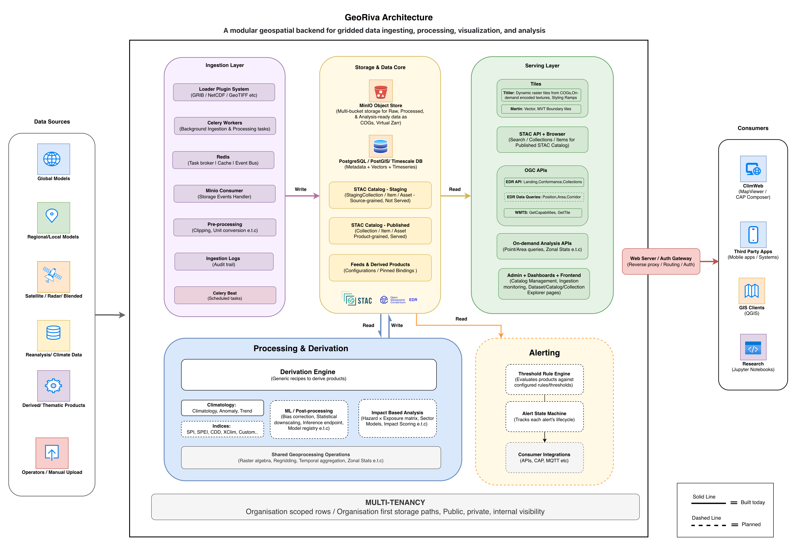
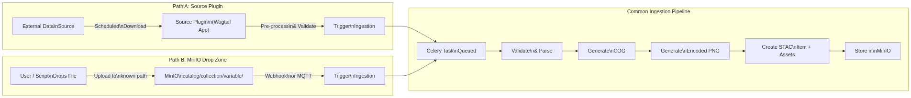
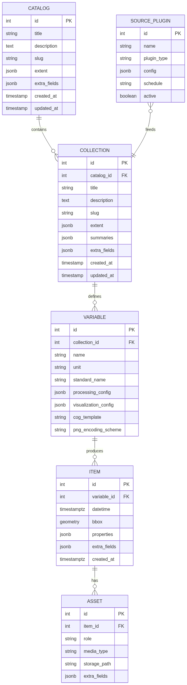
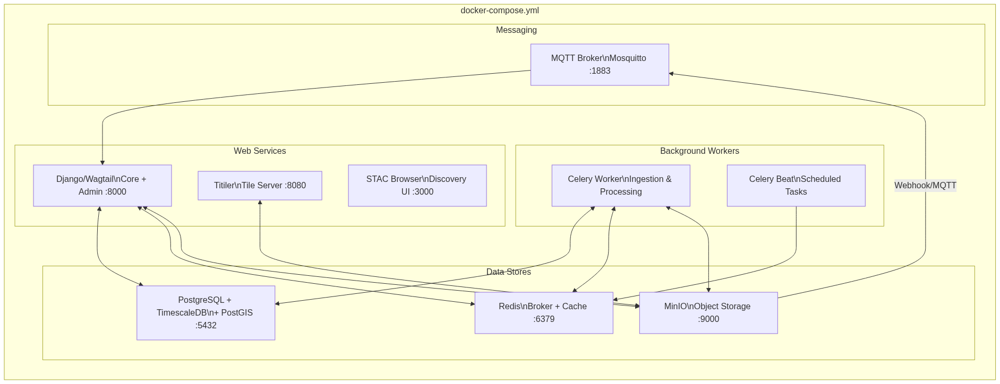

# GeoRiva — Architecture Design Document

**Geospatial Raster Ingestion, Visualization & Analysis**

|             |                                         |
|-------------|-----------------------------------------|
| **Status**  | Living document — partially implemented |
| **Version** | 0.3                                     |
| **Date**    | 2026-06-05                              |
| **Author**  | Erick Otenyo, WMO Africa                |

> **Note (v0.2):** This document began life as a pre-implementation RFC (v0.1, 2025-02-09). Much of
> the system is now built. Sections have been updated to reflect the as-built architecture; remaining
> aspirational items are called out inline. Related design: see
> [`plugin-parameter-contract.md`](./plugin-parameter-contract.md) and
> [`download-dedup.md`](./download-dedup.md).

---

## Table of Contents

- [1. Introduction](#1-introduction)
    - [1.1 Purpose & Scope](#11-purpose--scope)
    - [1.2 Design Principles](#12-design-principles)
    - [1.3 Intended Audience](#13-intended-audience)
- [2. System Architecture Overview](#2-system-architecture-overview)
    - [2.1 Layer Responsibilities](#21-layer-responsibilities)
- [3. Data Ingestion](#3-data-ingestion)
    - [3.1 Path A: Source Plugins](#31-path-a-source-plugins)
    - [3.2 Path B: MinIO Drop Zone](#32-path-b-minio-drop-zone)
    - [3.3 Common Ingestion Pipeline](#33-common-ingestion-pipeline)
- [4. Data Model](#4-data-model)
    - [4.1 Entity Descriptions](#41-entity-descriptions)
    - [4.2 Key Design Decisions](#42-key-design-decisions)
- [5. Data Serving & Visualization](#5-data-serving--visualization)
    - [5.1 STAC API](#51-stac-api)
    - [5.1a EDR API](#51a-edr-api)
    - [5.2 Tile Serving with Titiler](#52-tile-serving-with-titiler)
    - [5.3 On-Demand Encoded Textures for Frontend Shading Libraries](#53-on-demand-encoded-textures-for-frontend-shading-libraries)
    - [5.4 STAC Browser](#54-stac-browser)
    - [5.5 Vector Tiles with Martin](#55-vector-tiles-with-martin)
- [6. Staging & Derivation](#6-staging--derivation)
    - [6.1 The Two Tiers](#61-the-two-tiers)
    - [6.2 The Derivation Engine](#62-the-derivation-engine)
    - [6.3 Recipes](#63-recipes)
    - [6.4 Derived Products & Pinned Bindings](#64-derived-products--pinned-bindings)
    - [6.5 Lineage](#65-lineage)
    - [6.6 Shared Geoprocessing](#66-shared-geoprocessing)
- [7. Analysis Layer](#7-analysis-layer)
    - [7.1 Core Analysis Capabilities](#71-core-analysis-capabilities)
    - [7.2 Pluggable Analysis Modules](#72-pluggable-analysis-modules)
    - [7.3 Integration with Existing Analysis Libraries](#73-integration-with-existing-analysis-libraries)
    - [7.4 Zarr for Analysis-Ready Data](#74-zarr-for-analysis-ready-data)
    - [7.5 Mini-Dashboards](#75-mini-dashboards)
- [8. Multi-Tenancy & Access Control](#8-multi-tenancy--access-control)
    - [8.1 The Organisation](#81-the-organisation)
    - [8.2 Row-Level Scoping](#82-row-level-scoping)
    - [8.3 Visibility Tiers](#83-visibility-tiers)
    - [8.4 Identity](#84-identity)
    - [8.5 The Machine Plane](#85-the-machine-plane)
    - [8.6 Storage Paths](#86-storage-paths)
- [9. Infrastructure & Deployment](#9-infrastructure--deployment)
    - [9.1 Service Inventory](#91-service-inventory)
    - [9.2 Key Infrastructure Decisions](#92-key-infrastructure-decisions)
- [10. Technology Stack Summary](#10-technology-stack-summary)
- [11. Open Questions & Discussion Points](#11-open-questions--discussion-points)
    - [11.1 Read-Side Analysis Plugin Contract](#111-read-side-analysis-plugin-contract)
    - [11.2 EDR Data-Retrieval Plane](#112-edr-data-retrieval-plane)
    - [11.3 Derivation Backpressure](#113-derivation-backpressure)
    - [11.4 Analysis Library Integration Depth](#114-analysis-library-integration-depth)
    - [11.5 Zarr Beyond the Variable Level](#115-zarr-beyond-the-variable-level)
    - [11.6 Cross-Feed Derivation Inputs](#116-cross-feed-derivation-inputs)
- [12. Next Steps](#12-next-steps)

---

## 1. Introduction

This Architecture Design Document (ADD) lays out the technical vision, design principles, and system architecture for
GeoRiva — a geospatial backend platform for automated ingestion, visualization, and analysis of gridded raster data.

The document is structured as a Request for Comments (RFC). It captures the author's current thinking on how the system
should be built, and invites contributors to review, challenge, and refine the architecture before and during
implementation.

### 1.1 Purpose & Scope

GeoRiva is designed to serve as a general-purpose foundation for any system that needs to:

1. Pull gridded geospatial data from diverse sources
2. Process it for web-based visualization
3. Expose it through standards-compliant APIs
4. Enable analytical workflows — from simple time-series queries to complex domain-specific computations

The initial target domain is meteorological data for African National Meteorological Services, but the architecture is
intentionally domain-agnostic. Any field that works with gridded raster data (agriculture, hydrology, environmental
monitoring, etc.) should be able to build on GeoRiva.

### 1.2 Design Principles

- **STAC-first mental model:** We think in terms of Catalogs, Collections, and Items from the start, aligning our
  internal data model with the SpatioTemporal Asset Catalog (STAC) specification.
- **Plugin-driven extensibility:** Data sources and derivation recipes are implemented as plugins conforming to
  defined contracts, enabling community contributions without modifying the core engine. Read-side analysis is
  intended to follow the same pattern (§7.2).
- **Generic engines, declarative plugins:** The two engines — the Loader on the read-from-the-world side, the
  Derivation Engine on the write side — own their run loops entirely. Plugins *declare* (what to fetch, what to
  compute, what to emit) and never orchestrate. Nothing in either engine knows about climate semantics.
- **Compute once, share everywhere:** Numerical operations live in a pure, non-Django library (`geoprocessing/`) used
  identically by compute-on-write and compute-on-read, so "anomaly" has one implementation and one set of tests.
- **Modern, client-first visualization:** Prefer browser-side rendering of encoded data tiles — enabling smooth temporal
  animation, interactive value picking, client-side color ramps, and interpolation — over legacy server-styled WMS.
  Dynamically served tiles (Titiler for raster COGs, Martin for vector) remain available where server-side rendering is
  the better fit.
- **Cloud-optimized storage:** Cloud Optimized GeoTIFF (COG) as the canonical storage format, with MinIO (S3-compatible)
  as the object store.
- **Async-first processing:** All long-running operations (ingestion, derivation, analysis) run as Celery tasks on
  dedicated queues, keeping the web layer responsive and preventing any one workload from starving another.
- **Tenancy as an invariant, not a filter:** Several institutions share one deployment. Every model declares its
  owning organisation, all scoping goes through a single choke point, and every storage key begins with an org slug —
  so isolation is structural rather than something each query has to remember (§8).
- **One place to decide who sees what:** Tile servers and other general-purpose components hold no tenancy logic.
  Authorization happens at the proxy, in front of them.
- **Composable via Docker:** The entire stack is orchestrated via Docker Compose for consistent development and
  deployment.

### 1.3 Intended Audience

This document is intended for developers and contributors who will participate in building GeoRiva. It assumes
familiarity with Django, Docker, and basic geospatial concepts. Domain-specific terms (STAC, COG, Zarr) are explained
where they first appear.

---

## 2. System Architecture Overview

Data enters GeoRiva two ways — a source plugin fetches it, or a person drops it in — and lands in object storage. From
there, everything is driven by what arrives: an event bus wakes the ingestion pipeline, which writes a STAC-aligned
core; configured derived products decide whether anything further must be computed; and the serving layer reads that
core without knowing or caring how any of it got there.



*Figure 1: GeoRiva System Architecture Overview. Dashed elements are planned rather than built.*

The layers are deliberately loosely coupled. Ingestion knows nothing about visualization. The Derivation Engine knows
nothing about climate semantics. The tile servers know nothing about who is asking. Two properties cut across all of
them and cannot be opted out of:

- **Tenancy** (§8) — every row belongs to an organisation, every storage key begins with its slug, and every serving
  path is authorized before it reaches data.
- **The two tiers** (§6.1) — data is either *Staging* (source-grained, never served) or *Published* (product-grained,
  served). Which one a file lands in is computed from configuration, not chosen by hand.

### 2.1 Layer Responsibilities

| Layer                    | Responsibility                                                                                                                                            | Where                          |
|--------------------------|------------------------------------------------------------------------------------------------------------------------------------------------------------|--------------------------------|
| **Data Ingestion**       | Source plugins fetch on a schedule; the MinIO drop zone and admin upload accept files from people. Both land in object storage and raise the same event. | `sources/`, `ingestion/`       |
| **Ingestion Pipeline**   | Celery workers validate, extract, convert units, clip to boundaries, write COGs, and index STAC Items. Runs on `georiva-ingestion`.                      | `ingestion/`                   |
| **Storage & Data Core**  | The STAC-aligned models across two tiers, plus lineage and feed/product configuration. PostgreSQL + TimescaleDB + PostGIS; MinIO for binary assets.      | `core/`, `staging/`            |
| **Derivation**           | The generic engine that turns Staging (and Published) inputs into new Published products via declarative recipes. Runs on `georiva-processing`.          | `processing/`, `geoprocessing/`|
| **Data Serving**         | STAC API and EDR for discovery, Titiler for raster tiles and on-demand textures, Martin for vector tiles, WMTS capabilities, and the Wagtail frontend.   | `stac/`, `edr/`, `wmts/`       |
| **Analysis**             | Compute-on-read: point and area time-series, zonal statistics. Results are returned, not persisted.                                                       | `analysis/`                    |
| **Tenancy & Access**     | Cuts across all of the above: org-scoped rows, org-first storage paths, visibility tiers, and proxy-level authorization for the machine plane.           | `organisations/`, `accounts/`  |

---

## 3. Data Ingestion

GeoRiva supports two complementary ingestion paths that converge into a single processing pipeline. This dual-path
design accommodates both fully automated source integrations and manual or scripted data drops.



*Figure 2: Data Ingestion Flow*

### 3.1 Path A: Source Plugins

Source plugins are Wagtail apps that implement a defined base class (contract). Each plugin encapsulates the complete
logic for a specific data source:

- **Scheduling** — when to check for new data (cron or interval)
- **Downloading** — fetching from the remote source, returning a local file path
- **Pre-processing** — optional source-specific transformations (format conversion, subsetting, reprojection)
- **Triggering ingestion** — handing off to the common pipeline once a file is ready

The plugin architecture means new data sources can be developed and distributed independently of the core engine. A
plugin registers itself with the system and provides its admin UI through Wagtail's admin framework.

> **Plugin Contract (As-built):** A source plugin implements a `BaseDataSource`
> (`sources/source.py`) subclass — setting `type`/`label` and implementing `generate_requests()` —
> paired with a polymorphic **`DataFeed`** model (`sources/models.py`) that holds operator
> configuration and scheduling. A pluggable `FetchStrategy` performs the actual download. The
> **collection definition contract** (`get_collection_definitions()`) lets a plugin declaratively
> describe every collection and variable (including derived products such as wind U/V components) so
> the `Catalog → Collection → Variable` hierarchy can be provisioned by the setup wizard. See
> [`plugin-parameter-contract.md`](./plugin-parameter-contract.md) for the full as-built contract.

### 3.2 Path B: MinIO Drop Zone

For cases where a full plugin is unnecessary, data can be ingested by simply placing files in a structured MinIO
directory. The directory hierarchy encodes the target metadata:

```
incoming/{catalog_slug}/{collection_slug}/{variable_slug}/filename.tif
```

When a file is uploaded to this path, MinIO publishes an `s3:ObjectCreated:*` event to a **Redis
list** using its built-in Redis notification target (`arn:minio:sqs::primary:redis`, list key
`georiva:minio:events`). Notifications are configured per-bucket on `incoming` and `sources` by the
`setup_minio` management command. A dedicated consumer process (`georiva-minio-consumer`, the
`minio_event_consumer` command) blocks on that list (`BLPOP`), validates the object key, registers an
`IngestionLog`, and enqueues the `process_incoming_file` Celery task on the `georiva-ingestion` queue.
File naming conventions are defined per-variable to encode temporal information (e.g., timestamps,
forecast hours).

> **As-built note:** The original design called for an MQTT broker (Mosquitto) to carry MinIO
> notifications. This was replaced by MinIO's native **Redis** event target consumed by
> `georiva-minio-consumer`; Mosquitto is no longer part of the stack. The `sweep_unprocessed`
> periodic task acts as a safety net for any events the consumer misses.

### 3.3 Common Ingestion Pipeline

Regardless of the ingestion path, all data passes through the same Celery-powered pipeline:

1. **Queue:** A Celery task is created and queued for async execution.
2. **Validate:** The incoming file is parsed and validated against expected formats and metadata.
3. **Generate COG:** The data is converted to a Cloud Optimized GeoTIFF, the canonical (and only) stored asset format.
4. **Index as STAC Item:** A STAC Item record is created in TimescaleDB with the appropriate Catalog/Collection/Variable
   linkage.
5. **Store Assets:** The COG is stored in MinIO and an Asset record is linked to the Item.

Visualization textures are *not* produced here. Encoded PNGs used to be baked at ingestion time, which made every
existing PNG numerically wrong the moment an operator edited a variable's render range; Titiler now derives them on
demand instead (see [ADR-0021](../adr/0021-on-demand-encoded-textures.md) and §5.3).

---

## 4. Data Model

The core data model is loosely aligned with the STAC specification. This ensures that thinking in STAC terms is natural
from the start, and that exposing a STAC API requires minimal translation.



*Figure 3: STAC-Aligned Data Model*

The implemented hierarchy is:

```
Topic ──M2M──→ Catalog ──1:N──→ Collection ──1:N──→ Variable ──1:N──→ Item ──1:N──→ Asset
```

### 4.1 Entity Descriptions

**Topic** is a thematic tag (many-to-many with Catalog) used to group catalogs across domains for
discovery and navigation.

**Catalog** represents the top-level organizational container. A Catalog groups related Collections — for example by
thematic domain (weather forecasts, satellite observations, reanalysis products). It also owns
file-format, boundary, and clip-mode configuration.

**Collection** represents a coherent dataset within a Catalog. Collections share common spatial/temporal extents and
data characteristics. A Collection might represent "GFS Forecast Data" or "CHIRPS Rainfall Estimates."

**Variable** is a GeoRiva-specific extension to the STAC hierarchy. It represents a measured or computed quantity within
a Collection (e.g., temperature, precipitation, wind speed). The Variable model holds per-variable processing
configuration, visualization configuration (palette, value ranges, scale type), and the mapping to raw source bands. It
supports both **passthrough** variables (one source band, read directly) and **derived** variables — notably vector
products computed from U/V components (`VECTOR_MAGNITUDE` for wind speed, `VECTOR_DIRECTION` for wind direction) via the
`sources` StreamField and `transform_type`.

**Item** represents a single spatiotemporal data granule — one snapshot of one variable at one point in time. The Item
model is backed by a TimescaleDB hypertable keyed on the `time` column (the valid time), with an additional
`reference_time` column for forecast data (the model run time). Time-range queries are the dominant access pattern.

**Asset** represents a physical data object associated with an Item (following STAC conventions). Ingestion writes one
COG per variable per timestep. Encoded textures are derived on demand rather than stored
([ADR-0021](../adr/0021-on-demand-encoded-textures.md)), and the JSON metadata sidecar was removed
([ADR-0024](../adr/0024-remove-the-json-metadata-sidecar.md)), so a freshly ingested Item typically carries exactly one
Asset.

**DataFeed** (a polymorphic model, `sources/models.py`) tracks a configured data source: its global
scheduling interval (`interval_minutes`), source-specific operator configuration, and aggregate run
statistics. A DataFeed owns one `Catalog` (OneToOne) and links to one or more Collections through
**DataFeedCollectionLink** — the M2M through-model that carries per-collection configuration (e.g.
period, start date) and a per-collection `interval_minutes` override that allows different collections
in the same feed to run at different cadences. Individual executions are recorded as **DataFeedRun**
(aggregate stats) and surfaced live as **DataFeedJob** records via the async job system.

### 4.2 Key Design Decisions

- **TimescaleDB for Items:** The Item table is expected to grow rapidly and will be queried primarily by time range.
  TimescaleDB hypertables provide automatic partitioning and optimized time-range queries.
- **PostGIS for spatial:** The `bbox` field on Item uses PostGIS geometry types for spatial indexing and querying.
- **JSONB for extensibility:** `extra_fields` and `properties` columns use PostgreSQL JSONB to accommodate STAC
  extensions and custom metadata without schema migrations.
- **Variable as a first-class entity:** Standard STAC does not have a Variable concept. GeoRiva introduces it to hold
  per-variable configuration that would otherwise be duplicated across Items or encoded in Collection-level metadata.

---

## 5. Data Serving & Visualization

The serving layer is designed around a key philosophy: move rendering to the browser and serve data in formats that
enable modern, interactive visualization experiences comparable to applications like Windy.com.

### 5.1 STAC API

GeoRiva exposes a standards-compliant STAC API (`/api/stac/`) for data discovery. This allows any STAC-compatible client
(including the bundled STAC Browser) to search, filter, and browse the data catalog. The API is generated from the
internal data model with minimal translation since the models are STAC-aligned by design.

### 5.1a EDR API

Alongside STAC, GeoRiva exposes an **Environmental Data Retrieval (EDR) API** (`/api/edr/`, OGC API – EDR 1.1). EDR is
purpose-built for spatio-temporal environmental data and provides query patterns — position, area, cube — that suit
point/time-series extraction from gridded fields far better than STAC item search. An async **Jobs API** (`/api/jobs/`)
exposes the status of long-running loader and processing jobs.

> **As-built status (v0.2):** The EDR **metadata plane** is implemented: landing page, conformance
> (core, collections, oas30, html, geojson), collection list, and collection detail. The detail
> document is the GetCapabilities equivalent — it advertises spatial/temporal extents, the explicit
> timestep list, `parameter_names` with units and WeatherLayers palette hints (under an `x-georiva`
> extension), the advertised `data_queries`, and a canonical cross-link to the matching STAC
> collection. Collection ID = `Collection.slug`.
>
> **Gaps:** The EDR **data-retrieval plane is not yet implemented** — `position`, `area`, `locations`,
> `instances`, and `cube` endpoints are stubbed/commented out. CoverageJSON output is not yet offered
> (only JSON/GeoJSON). In the interim, equivalent point/area extraction is available through the
> Analysis API (§7.1), which is not yet wired under the EDR query paths.

### 5.2 Tile Serving with Titiler

Titiler serves map tiles directly from Cloud Optimized GeoTIFFs stored in MinIO. It holds no database connection of its
own: render configuration reaches it through a Redis cache, falling back to a Django callback
(`/api/tile-config/{org}/{catalog}/{collection}/{variable}/`) on a miss.

Both tile strategies originally under discussion are now served, and the choice belongs to the caller:

- **Styled tiles:** Titiler applies a color ramp server-side and returns pre-styled image tiles. Ramps and per-variable
  styles are configured in the admin ([ADR-0022](../adr/0022-two-layer-styling-ramps-and-variable-styles.md)), and a
  variable may expose several ([ADR-0023](../adr/0023-style-multiplicity-on-the-machine-plane.md)).
- **Encoded textures:** Titiler returns raw data-encoded pixels that the frontend shading library interprets and styles
  itself — see §5.3.

Titiler carries no tenancy logic. Every tile request is authorized by nginx before it arrives (§9.2).

### 5.3 On-Demand Encoded Textures for Frontend Shading Libraries

For integration with frontend shading libraries like WeatherLayers GL, Titiler serves encoded textures where pixel
values represent actual data values (not visual colors). The frontend library decodes these values and applies styling,
interpolation, and animation in the browser. This approach enables:

- Smooth temporal animations between time steps
- Interactive value picking (hover to see the value at any point)
- Custom color ramps applied client-side in real time
- Particle/wind animations from vector data

These textures are **derived per request, never stored**. `SemanticRescale` in `titiler-app` resolves the variable's
current `value_min`/`value_max` from Redis/Django at request time, so editing a render range takes effect immediately
with no regeneration, no staleness marking, and no mixed old/new serving window
([ADR-0021](../adr/0021-on-demand-encoded-textures.md)).

### 5.4 STAC Browser

A standalone STAC Browser service is included in the Docker stack, connected to GeoRiva's STAC API. This provides an
out-of-the-box discovery and preview interface without requiring custom frontend development.

### 5.5 Vector Tiles with Martin

For vector overlays — primarily administrative boundaries used in clipping and zonal statistics — the stack includes a
**Martin** vector tile server (`georiva-martin`) reading directly from PostGIS. This serves boundary geometries as
MVT/PBF tiles to the frontend, complementing Titiler's raster tiles.

---

## 6. Staging & Derivation

Not every file that arrives is ready to serve. A raw CHIRPS series is an *input* to a monthly anomaly, not a layer
anyone should see on a map; a climatological baseline is consumed by an index and never rendered on its own. GeoRiva
separates those two populations into **tiers**, and the act of turning one into the other is **Derivation**.

This is the write-side counterpart of §3's ingestion. It has its own app (`processing/`), its own Celery queue
(`georiva-processing`), and its own decision record ([ADR-0005](../adr/0005-generic-derivation-engine.md)).

### 6.1 The Two Tiers

| Tier          | Grain            | Served? | Model                                   |
|---------------|------------------|---------|-----------------------------------------|
| **Staging**   | source / acquisition — one Item per raw file | No  | `staging/` — `StagingCollection`, `StagingItem`, `StagingAsset` |
| **Published** | product — one Item per timestep              | Yes | `core/` — `Collection`, `Item`, `Asset` |

Both mirror the STAC spec (Collection / Item / Asset) and share abstract base models, but they answer different
questions. A `StagingItem` follows the shape of the *file that arrived*: one row per raw artifact, a flexible temporal
extent (nullable `datetime` plus optional `start_datetime`/`end_datetime`), and assets carrying the `source` role. It is
deliberately **not** a TimescaleDB hypertable, because there is no per-timestep row to key one on. A Published `Item`
*is* a hypertable row — one per timestep — because that is the access pattern serving needs
([ADR-0004](../adr/0004-staging-tier-and-abstract-stac-models.md)).

"Raw" is expressed as an asset *role*, not as a tier name. And "Published" does not mean "public": a Published
Collection carries a `visibility` of `public`, `private`, or `internal` (§8). **Intermediate products** — a climatology
that only exists to feed an index — live in Published with `visibility=internal`: they are product-shaped and derived,
so Staging would be the wrong tier, but nothing should ever serve them.

Which tier a file lands in is **computed, not configured**. The Loader routes a fetched file to the staging bucket if
and only if some enabled derived product of that feed declares a staging-tier input on that collection; otherwise it
goes straight to Published. There is no operator toggle, because a toggle produces a drift class — "configured to
publish, but a product needs staging, so the product silently never runs" ([ADR-0008](../adr/0008-configurable-derivation-products.md)).
The rule is: *no derivation, no staging.*

### 6.2 The Derivation Engine

The engine (`processing/engine.py`) is the generic, domain-agnostic run loop — the write-side counterpart of the
Loader. It owns:

```
enumerate units → take the run lock → resolve inputs → idempotency check → readiness
    → compute (recipe.transform) → write asset → register Published Item/Asset
    → write DerivationLinks → emit event
```

It knows nothing about climate semantics — no seasons, no baselines, no indices. The same primitive,
`run(recipe, selector)`, serves event-driven, scheduled, and manual invocation, so a backfill and a live trigger take
the same path through the same code.

Per-unit compute is dispatched to the `georiva-processing` queue so a long derivation run cannot starve ingestion, and
ingestion cannot starve it.

### 6.3 Recipes

A **recipe** is a declarative plugin registered against the engine (`@RecipeRegistry.register`) describing one family of
derivation. It declares, and does not execute:

| Hook                | Declares                                                          |
|---------------------|-------------------------------------------------------------------|
| `enumerate_units`   | the production units this run should cover                        |
| `declared_inputs` / `resolve_inputs` | named selectors over Staging and/or Published        |
| `readiness`         | whether a unit's inputs are complete enough to compute            |
| `transform`         | the pure computation                                              |
| `outputs`           | the Published Collection slug and Item time key to write into     |

Two recipes ship today: **promotion** (Direct → Published, for ready products needing only inline normalization) and
**climatology** (a staging series → climatologies, anomalies, relative anomalies and trends across
`period × season × quantity`). Recipe families for ML/forecast post-processing and impact-based analysis register the
same way, without editing the engine.

### 6.4 Derived Products & Pinned Bindings

Recipes describe *how*. What decides **which** recipe runs, on what, and when, is configuration:

- A **Derived Product Definition** is the plugin-agnostic blueprint a feed offers — `recipe_type`, a `config_schema`,
  declared inputs/outputs, and a `trigger_mode` of `event | scheduled | manual`. Pure declaration in `core`, so both the
  feed layer and the engine can read it without a circular dependency.
- A **`DerivedProduct`** is the operator's saved configuration of one such blueprint, created through the setup wizard.
- **Pinned bindings** (`DerivedProductInput` / `DerivedProductOutput`) resolve the product's feed-local collection keys
  to actual catalog `Collection` FKs, **once**, at enable time ([ADR-0010](../adr/0010-pinned-collection-bindings-for-derived-products.md)).

Pinning is what makes dispatch cheap and safe. When an input lands,
`sources.derivation_invocation.dispatch_for_input` matches the trigger's `(collection_id, tier)` against the pinned rows
in one indexed query, then calls the engine's generic `run(recipe, selector)`. Because the match is by foreign key,
catalog scoping falls out for free — an Item in one catalog cannot trigger another catalog's products even under a
shared slug — and renaming a collection cannot break a binding. This module is the *only* place that joins product
configuration to the engine, which is what keeps the engine free of any import from the feed layer.

### 6.5 Lineage

Every derived Item records where it came from. A **`DerivationLink`** is one row per (output, input) edge, tagged with
the recipe id, recipe version, and an input hash. Inputs may be Staging or Published Items — exactly one of the two
source FKs is set, enforced by a check constraint.

Lineage is **descriptive, not an execution plan**: it records what happened, and is not consulted to decide what to run
next. It lives in the `staging` app so the data-layer dependency direction stays `staging → core`, leaving `core`
dependency-free.

### 6.6 Shared Geoprocessing

The numerical work lives in `geoprocessing/` — a pure, **non-Django** library. Functions take in-memory rasters (numpy
arrays with an affine transform and CRS, or xarray objects) plus parameters, and return rasters or scalars. No Django,
no storage, no request layer: callers own their own I/O.

| Module        | Provides                                                        |
|---------------|-----------------------------------------------------------------|
| `algebra`     | `raster_combine`, `safe_divide`                                 |
| `temporal`    | `climatology`, `anomaly`, `trend`, `temporal_aggregate`, seasons |
| `regrid`      | `regrid_array` (via `rasterio.warp.reproject`)                  |
| `calendar`    | `convert_calendar` (via xarray + cftime)                        |
| `zonal`       | `zonal_stats_from_array`, `mask_and_aggregate`, geometry reprojection |

This is deliberately shared between **compute-on-write** (derivation, §6.2) and **compute-on-read** (analysis, §7). One
implementation of "anomaly" serves both, and every operation is unit-testable without a database.

---

## 7. Analysis Layer

The analysis layer is where GeoRiva moves beyond data serving into data processing. The vision is to provide
analysis-ready datasets and a pluggable framework that can leverage the broader ecosystem of scientific Python libraries
for domain-specific computation.

### 7.1 Core Analysis Capabilities

At its foundation, the system will support:

- Time-series extraction at points and over regions
- Spatial subsetting and aggregation
- Basic statistical summaries

These are the building blocks that all higher-level analysis modules can rely on.

> **As-built status (v0.2):** The analysis layer is implemented as two concrete, purpose-built modules
> under `analysis/` rather than the generic operator framework originally envisioned in §7.2.
>
> **Time-series (`analysis/timeseries/`)** — extracts series from the per-variable **virtual Zarr
> manifests** (§7.4) via xarray. Two endpoints:
> - `GET /api/analysis/timeseries/point/` — nearest-grid-cell series for a lat/lon (synchronous).
> - `POST /api/analysis/timeseries/area/` — zonal series over an arbitrary GeoJSON polygon: bbox
    > subset → `regionmask` polygon mask → `mean`/`sum`/`min`/`max`/`std` aggregation (synchronous;
    > designed to move to Celery for large areas).
>
> **Zonal statistics (`analysis/zonal_stats/`)** — *precomputed* admin-boundary statistics. A Celery
> task (`compute_boundary_zonal_stats`, `georiva-ingestion` queue) runs per COG asset using
> `rasterio.mask`, writing `mean/min/max/sum/std/count` per (Item × Variable × AdminBoundary) into the
> `BoundaryZonalStats` TimescaleDB hypertable. Levels come from `Collection.boundary_stats_levels` and
> the `adminboundarymanager` package; a `compute_boundary_stats` command backfills history. These
> stats are served to the frontend as **vector tiles via Martin** (a generated PostgreSQL function,
> `create_martin_function`, exposed at `/martin/boundary_stats/{z}/{x}/{y}`). That function requires
> `org`, `catalog`, `collection` and `variable` query params — Martin sees no Host, so the
> organisation travels in the URL Django writes (ADR 0013). There is no DRF endpoint for zonal stats
> yet — they are consumed through Martin/DB.

### 7.2 Pluggable Analysis Modules

> **Terminology.** Earlier revisions of this document described analysis modules as producing new derived Items that
> flow back into the core. That work is now **Derivation** (§6) and lives in `processing/`, not here. The distinction is
> load-bearing:
>
> - **Derivation** is the write-side act — compute *and persist*. Runs on the `georiva-processing` queue, writes
>   Published Items, records lineage. "Derivation = analysis you persist."
> - **Analysis** is the read-side act — compute *on read*, in response to a request, and do not persist.
>
> Both call the same `geoprocessing/` library (§6.6). What separates them is whether the result becomes a row.

What remains open here is a plugin contract for the **read side**: a base contract letting contributors add new
compute-on-read operations — agricultural indices, hydrological summaries, forecast verification — without modifying
the core. Such a module would define:

- **Input requirements** — which Items/Variables it consumes
- **Computation logic** — the actual processing, ideally delegated to `geoprocessing/` or the wider Xarray ecosystem
- **Output specification** — the response shape it returns

A module that needs to *persist* its output should be a recipe (§6.3), not an analysis module.

> **As-built gaps:** This read-side plugin framework is **not yet implemented**. There is no analysis
> operator registry or plugin contract today (an earlier `analysis/registry.py` / `OperatorRegistry`
> no longer exists); the two shipped modules (§7.1) are wired directly. Integration with external
> libraries (Xclim, Verde, scikit-learn, §7.3) is also not yet present; current analysis uses xarray,
> `regionmask`, and rasterio only. Formalizing the contract — ideally sharing the parameter-manifest
> vocabulary from [`plugin-parameter-contract.md`](./plugin-parameter-contract.md) — remains future
> work. Note that the *write-side* equivalent is done: recipes register against the Derivation Engine
> today (§6.3).

### 7.3 Integration with Existing Analysis Libraries

A core design goal is to not reinvent the wheel. The scientific Python ecosystem already has excellent libraries for
working with gridded data, and GeoRiva's data formats (COGs, Zarr, Xarray-compatible structures) are chosen specifically
to interoperate with them.

Analysis modules are expected to leverage existing packages rather than implement algorithms from scratch. Some examples
of the kinds of libraries that fit naturally:

| Library       | Domain                    | Example Use                                                   |
|---------------|---------------------------|---------------------------------------------------------------|
| Xclim         | Climate indices           | SPI, SPEI, growing degree days, heat wave detection           |
| Xarray / Dask | General array computation | Resampling, aggregation, parallel processing                  |
| Rioxarray     | Raster I/O                | Reading/writing COGs within analysis pipelines                |
| Verde         | Spatial processing        | Gridding, trend estimation, cross-validation                  |
| scikit-learn  | Machine learning          | Anomaly detection, classification, regression on gridded data |
| Regionmask    | Regional analysis         | Masking and aggregation by geographic regions                 |

The key consideration is Xarray compatibility — if a library works with Xarray datasets, it should slot into GeoRiva's
analysis framework with minimal friction. The system is not tied to any single analysis domain; the plugin contract
simply needs a module that can read Items in and produce Items out.

### 7.4 Zarr for Analysis-Ready Data

While COG is the canonical storage format for individual Items, Zarr is planned as an additional format for
analysis-ready data cubes. Zarr archives can be generated at the Catalog, Collection, or Variable level, aggregating
many Items into a single chunked, cloud-optimized array suitable for large-scale computation with tools like Xarray and
Dask.

> **As-built status (v0.2):** Implemented as **virtual Zarr** rather than materialized Zarr archives.
> Using `virtualizarr` + `virtual-tiff` (kerchunk), GeoRiva builds a manifest that references the
> existing COG assets *in place* — no data is copied or re-chunked. This is realized in the
> `virtual_zarr/` app:
> - One `VirtualZarrManifest` per **Variable** (a Wagtail snippet), tracking build state via a
    > `pending → building → ready → stale → failed` state machine with distributed locking and crash
    > recovery (same pattern as `IngestionLog`).
> - Manifests are kerchunk JSON stored in a dedicated `georiva-zarr` bucket; `open_dataset()` returns
    > a lazy, dask-backed `xarray.Dataset`.
> - Built by the `build_virtual_zarr` command and Celery tasks; a signal marks a manifest **stale**
    > when new COG assets land, and a sweep debounces rebuilds.
> - This is what the time-series analysis service reads from (§7.1).
>
> **Resolved design question:** This answers §11.2 — virtual Zarr is generated at the **Variable** level
> and maintained automatically (stale-on-write + sweep), with no data duplication.
>
> **Gaps:** Only Variable-level virtual cubes exist; Collection/Catalog-level aggregation and
> materialized Zarr (for heavy Dask workloads or external sharing) are not implemented. Manifests
> cover COG assets only.

### 7.5 Mini-Dashboards

Analysis results and key data summaries will be presentable as mini-dashboards embedded throughout the system. These are
lightweight, auto-updating views that surface insights from the analysis layer without requiring users to build custom
visualizations.

> **As-built status (v0.2):** Not yet a general capability. An operational **ingestion dashboard**
> frontend exists (`ingestion/ingestion-dashboard/`), and the `visualization/` app currently provides
> Wagtail admin hooks only (its DRF views are a stub). Map visualization is delivered via the
> `tile-config` endpoint, encoded PNGs + WeatherLayers GL, Titiler raster tiles, and Martin vector
> tiles rather than embedded analysis mini-dashboards.

---

## 8. Multi-Tenancy & Access Control

GeoRiva is designed to host several institutions on one deployment — a regional centre and the national services it
serves, each seeing their own data and each other's only where that was intended. Tenancy is therefore not a feature
bolted onto the side; it is an invariant that every layer has to honour.

### 8.1 The Organisation

An **Organisation** is an institution. It owns a Wagtail `Site` (so each org answers on its own hostname), a page tree,
a page-permission group, and everything downstream: catalogs, collections, items, assets, feeds, boundaries. The active
organisation is resolved from the request's host.

Provision one with `create_organisation <slug> --name "…"`. A fresh install has none — `bootstrap_central_org` claims
Wagtail's default Site for a first, central org, and must be run before anything is ingested.

### 8.2 Row-Level Scoping

Every model declares where it stands via an `ORGANISATION_LOOKUP`: an ORM path to the owning organisation, or one of the
sentinels `SHARED_REFERENCE_DATA`, `ORGANISATION_SELF`, `PAGE_TREE`, `NOT_ORM_SCOPABLE`, `via_related(path)`, or
`via_content_object(...)`. A model that declares nothing cannot be scoped, and **raises** rather than silently leaking
([ADR-0011](../adr/0011-row-level-tenancy-choke-point.md)).

Scoping goes through one dispatcher in `organisations/ownership.py` — `scope_rows` for a queryset,
`belongs_to_active_org` for an object in hand. Callers never read declarations themselves. A nullable lookup path
combined with `ORGANISATION_GLOBAL_TIER` means *null = the instance-wide tier*: readable by every org, writable only by
the instance administrator.

Wagtail pages are org-owned through the Site → root-page link. The dispatcher scopes them, and Wagtail's own
pk-taking page views — which would otherwise let one org open another's page by guessing an id — are closed separately
([ADR-0016](../adr/0016-per-org-page-trees-in-the-admin.md)).

### 8.3 Visibility Tiers

A Published Collection carries one of three visibilities:

| Visibility | Who may see it                                    |
|------------|---------------------------------------------------|
| `public`   | anyone                                            |
| `private`  | members of the organisation owning the host       |
| `internal` | nobody — never served, on any plane, to anyone    |

Serving code never filters `visibility` by hand; it goes through `Collection.objects.visible_to(request)`.
`internal` is what makes intermediate derivation products (§6.1) safe to keep in the Published tier.

### 8.4 Identity

Two credentials reach the same `request.user`: a session (browser, admin) and a per-user API key prefixed `grv_`
(machines, notebooks, GIS clients). Every serving plane applies them in the same order —
`ApiKeyAuthentication`, then session — so a member's key widens what they can see exactly as their login would, and a
broken key produces the same 401 everywhere ([ADR-0014](../adr/0014-private-tier-and-per-user-api-keys.md)).

### 8.5 The Machine Plane

Tile servers and other machine consumers cannot rely on a `Host` header alone, so the organisation travels **in the
path**: `/titiler/<org>/<catalog>/<collection>/<variable>/…`, `/api/tile-config/<org>/…`,
`/martin/boundary_stats/{z}/{x}/{y}?org=…` ([ADR-0013](../adr/0013-org-in-the-path-on-the-machine-plane.md)). These URLs
are always built through `core/machine_plane/addresses.py`, never by hand.

Authorization for those routes happens at the **proxy**, not in the tile servers (§9.2). Titiler and Martin stay
general-purpose and tenancy-free; nginx asks `core/machine_plane/auth_view.py` first
([ADR-0015](../adr/0015-nginx-auth-request-gateway-for-tiles.md)).

One deliberate exception: the `tile-config` callback is `public`-only. Titiler forwards no credential when it calls
back for render configuration, so there is nobody to ask — and answering anything but `public` there would leak.

### 8.6 Storage Paths

Tenancy is expressed in object storage too. The first segment of every key on every bucket is the owning organisation's
slug:

```
{org}/{catalog}/{collection}/{variable}/{year}/{month}/{day}/
```

This makes ownership legible from a path alone, and makes per-org bucket policies or exports possible without a
database lookup.

---

## 9. Infrastructure & Deployment



*Figure 4: Docker Compose Stack. This figure predates the `georiva-processing` worker and the
`staging-consumer`; the inventory below is authoritative until it is regenerated.*

### 9.1 Service Inventory

| Service (compose name)                    | Technology                            | Purpose                                                                   |
|-------------------------------------------|---------------------------------------|---------------------------------------------------------------------------|
| Web Application (`georiva`)               | Django / Wagtail                      | Core engine, admin, STAC API, EDR API, Jobs API, plugin host              |
| Default Worker (`...-default-worker`)     | Celery                                | Lightweight tasks (sweeps, cleanup, scheduling) — `georiva-default` queue |
| Ingestion Worker (`...-ingestion-worker`) | Celery                                | Heavy data processing — `georiva-ingestion` queue                         |
| Processing Worker (`...-processing-worker`) | Celery                              | Per-unit derivation compute — `georiva-processing` queue                  |
| Scheduler (`...-celery-beat`)             | Celery Beat                           | Schedules periodic tasks (source polling, sweeps, maintenance)            |
| MinIO Consumer (`...-minio-consumer`)     | App process (BLPOP)                   | Consumes MinIO events from a Redis list and enqueues drop-zone ingestion  |
| Staging Consumer (`...-staging-consumer`) | App process (BLPOP)                   | Same, for files landing in the staging bucket ahead of derivation         |
| Tile Server (`...-titiler-app`)           | Titiler (FastAPI)                     | Serves raster map tiles from COGs in MinIO                                |
| Vector Tiles (`...-martin`)               | Martin                                | Serves boundary/vector MVT tiles from PostGIS                             |
| STAC Browser (`...-stac-browser`)         | stac-browser                          | Standalone STAC catalog browsing UI                                       |
| Web Proxy (`...-web-proxy`)               | Nginx                                 | Reverse proxy, static & media, **and the `auth_request` tile auth gateway**|
| Database (`...-db`)                       | PostgreSQL 18 + TimescaleDB + PostGIS | Models, time-series hypertables, spatial data                             |
| Connection Pooler (`...-pgbouncer`)       | PgBouncer                             | Pools DB connections for the app and Martin                               |
| Cache / Broker (`...-redis`)              | Redis                                 | Celery broker, application cache, and MinIO event bus                     |
| Object Storage (`...-minio`)              | MinIO                                 | S3-compatible storage for all binary assets                               |

### 9.2 Key Infrastructure Decisions

- **MinIO over cloud S3:** MinIO provides S3 API compatibility while keeping the entire stack self-contained for
  on-premises deployment, which is critical for many National Meteorological Services.
- **TimescaleDB over raw PostgreSQL:** The Item model's time-series nature makes TimescaleDB's hypertables and
  compression essential for performance at scale.
- **Redis-based event ingestion:** MinIO publishes bucket notifications to a Redis list via its native Redis target; a
  dedicated consumer (`georiva-minio-consumer`) drains the list and enqueues Celery tasks for the drop-zone path. This
  replaced the originally-planned MQTT/Mosquitto broker, removing an infrastructure component and reusing Redis.
- **Split Celery workers:** Three queues and three worker services separate lightweight orchestration
  (`georiva-default`) from heavy ingestion (`georiva-ingestion`) and from per-unit derivation compute
  (`georiva-processing`), so neither large ingests nor long derivation runs can starve routine tasks — or each other.
- **Tile authorization at the proxy:** Titiler and Martin hold no tenancy logic. Nginx issues an `auth_request`
  subrequest into `core/machine_plane/auth_view.py` before proxying any tile, so both tile servers stay
  general-purpose and there is exactly one place that decides who may see what
  ([ADR-0015](../adr/0015-nginx-auth-request-gateway-for-tiles.md)).
- **PgBouncer connection pooling:** A pooler fronts PostgreSQL so the app workers and Martin can share a bounded set of
  database connections.
- **Redis as triple-purpose:** Redis serves as the Celery broker, the application cache, *and* the MinIO event bus,
  reducing the number of infrastructure components.

---

## 10. Technology Stack Summary

| Category         | Technology                            | Notes                                       |
|------------------|---------------------------------------|---------------------------------------------|
| Web Framework    | Django 5.x + Wagtail 7.x              | Core engine, admin, plugin host             |
| Database         | PostgreSQL 18 + TimescaleDB + PostGIS | Primary data store (TimescaleDB HA image)   |
| Connection Pool  | PgBouncer                             | DB connection pooling                       |
| Object Storage   | MinIO                                 | S3-compatible, self-hosted                  |
| Task Queue       | Celery + Redis                        | Async processing, three queues              |
| Raster Tiles     | Titiler                               | COG-native tile serving                     |
| Vector Tiles     | Martin                                | MVT tiles from PostGIS (boundaries)         |
| Discovery APIs   | STAC API + OGC API – EDR              | Catalog search + environmental retrieval    |
| STAC Browser     | Radiant Earth stac-browser            | Data discovery UI                           |
| Analysis         | Xarray-compatible ecosystem           | Pluggable, domain-agnostic                  |
| Data Formats     | COG, virtual Zarr (kerchunk/Icechunk) | Stored formats; textures derived on demand  |
| Frontend Viz     | WeatherLayers GL                      | Browser-side rendering                      |
| Event Ingestion  | MinIO → Redis list → consumer         | Drop-zone notifications (Mosquitto dropped) |
| Reverse Proxy    | Nginx                                 | Routing, static/media, tile auth gateway    |
| Multi-tenancy    | Org-scoped rows + org-first paths     | Row-level choke point, visibility tiers     |
| Containerization | Docker + Docker Compose               | Full stack orchestration                    |
| Language         | Python 3.12+                          | Primary development language                |

---

## 11. Open Questions & Discussion Points

This section is a live list of what is **not** settled. Decisions that *have* been made live in
[`docs/adr/`](../adr/) — see the table at the end of this section for the ones this document used to debate.

### 11.1 Read-Side Analysis Plugin Contract

The write side is done: recipes register against the Derivation Engine and new families need no core changes (§6.3).
The read side has no equivalent. The two shipped modules (time-series, zonal stats) are wired directly, and there is no
contract a contributor could implement to add a third.

Open: should it share the parameter-manifest vocabulary from
[`plugin-parameter-contract.md`](./plugin-parameter-contract.md)? Should a read-side module be allowed to be
long-running (Celery + job polling), or must it answer within a request?

### 11.2 EDR Data-Retrieval Plane

The metadata plane is complete; `position`, `area`, `locations`, `instances` and `cube` are not implemented (§5.1a).
Equivalent point/area extraction exists today under the Analysis API, which raises the real question: should the EDR
query endpoints be implemented natively, or should they be a thin OGC-conformant façade over the analysis services —
and is CoverageJSON output worth the dependency?

### 11.3 Derivation Backpressure

Trigger mode is settled (`event | scheduled | manual`, per product). What is not settled is what happens under load:
a bulk backfill can enqueue a very large number of per-unit compute tasks at once. The dedicated `georiva-processing`
queue stops that starving ingestion, but says nothing about ordering, coalescing, or fairness *within* derivation when
several products are triggered by the same arriving input.

### 11.4 Analysis Library Integration Depth

How deeply should GeoRiva integrate with external analysis libraries? Should the system provide thin wrappers that make
it easy to call libraries like Xclim or Verde from within plugins, or should plugins be fully responsible for managing
their own dependencies? This becomes concrete as soon as the planned index recipes (SPI, SPEI, CDD, R95p) need Xclim.

### 11.5 Zarr Beyond the Variable Level

Variable-level virtual Zarr is built and maintained automatically (§7.4). Collection- and Catalog-level aggregation,
and materialized (re-chunked) Zarr for heavy Dask workloads or external sharing, are not. Open: is the demand real
enough to justify the maintenance surface, and would materialized Zarr reintroduce the staleness problem that
[ADR-0021](../adr/0021-on-demand-encoded-textures.md) removed elsewhere?

### 11.6 Cross-Feed Derivation Inputs

A derived product's inputs resolve within its own feed — every collection reference is a feed-local key
([ADR-0010](../adr/0010-pinned-collection-bindings-for-derived-products.md)). Combining collections from *different*
feeds (say, satellite rainfall with a reanalysis temperature) is deliberately deferred. Open: what should the
namespace look like, and who owns a product whose inputs span two feeds?

### Decided — see the ADRs

Questions this document used to carry, and where their answers now live:

| Question                          | Decision                                                                        | Record |
|-----------------------------------|---------------------------------------------------------------------------------|--------|
| Titiler: encoded or styled tiles? | Both. Styled via admin-configured ramps; encoded textures derived on demand.     | [0021](../adr/0021-on-demand-encoded-textures.md), [0022](../adr/0022-two-layer-styling-ramps-and-variable-styles.md), [0023](../adr/0023-style-multiplicity-on-the-machine-plane.md) |
| At what level is Zarr generated?  | Virtual (kerchunk) manifests per **Variable**, built automatically, no re-chunking. | §7.4 |
| How are plugins distributed?      | Standalone PEP 621 packages: build-time, runtime, or editable local dev.          | [installation.md](../plugins/installation.md) |
| Where does raw-but-unserved data live? | A **Staging** tier, source-grained, mirroring STAC but not a hypertable.     | [0004](../adr/0004-staging-tier-and-abstract-stac-models.md) |
| Who orchestrates derivation?      | A generic engine owns the run loop; recipes only declare.                        | [0005](../adr/0005-generic-derivation-engine.md) |
| How is a derived product configured and triggered? | Declared blueprints, saved per feed, bound to collections by FK at enable time. | [0008](../adr/0008-configurable-derivation-products.md), [0009](../adr/0009-derived-product-chain-and-lifecycle.md), [0010](../adr/0010-pinned-collection-bindings-for-derived-products.md) |
| Should the STAC API be public? Are catalogs access-controlled? | Three visibility tiers per collection; org membership decides `private`. | [0014](../adr/0014-private-tier-and-per-user-api-keys.md) |
| How is multi-tenancy enforced?    | One row-level choke point; every model declares its owning organisation.          | [0011](../adr/0011-row-level-tenancy-choke-point.md) |
| How do tile servers learn who is asking? | They don't — nginx authorizes via `auth_request` before proxying.           | [0015](../adr/0015-nginx-auth-request-gateway-for-tiles.md) |
| Should encoded PNGs be stored?    | No — derived per request against the variable's current range.                    | [0021](../adr/0021-on-demand-encoded-textures.md) |

---

## 12. Next Steps

Remaining work, roughly in the order it blocks other things:

1. **EDR data-retrieval plane** — implement the query endpoints, or decide they are a façade over the Analysis API
   (§11.2).
2. **Read-side analysis plugin contract** — formalize the base contract so a third module needs no core changes
   (§11.1).
3. **Index recipes** — SPI, SPEI, CDD, R95p and friends, which forces the Xclim integration question (§11.4).
4. **WMTS `GetTile`** — capabilities are served; tile fetching still has to be proxied through Titiler.
5. **Collection-level virtual Zarr** — multi-variable and collection-level aggregation (§11.5).
6. **Derivation backpressure** — ordering and coalescing under bulk backfill (§11.3).

Beyond that, three capability areas are designed-for but unbuilt, and appear dashed on Figure 1: ML/forecast
post-processing, impact-based analysis, and threshold alerting with CAP/MQTT delivery. Each is a recipe family or a new
app rather than a change to the engine — which is the point of §6.2's split between the generic run loop and
declarative plugins.

---

> **How to Contribute:** This is a living document. If you have questions, suggestions, or disagreements with any aspect
> of the design, please open an issue or start a discussion. The best architectures emerge from collaborative
> refinement.
